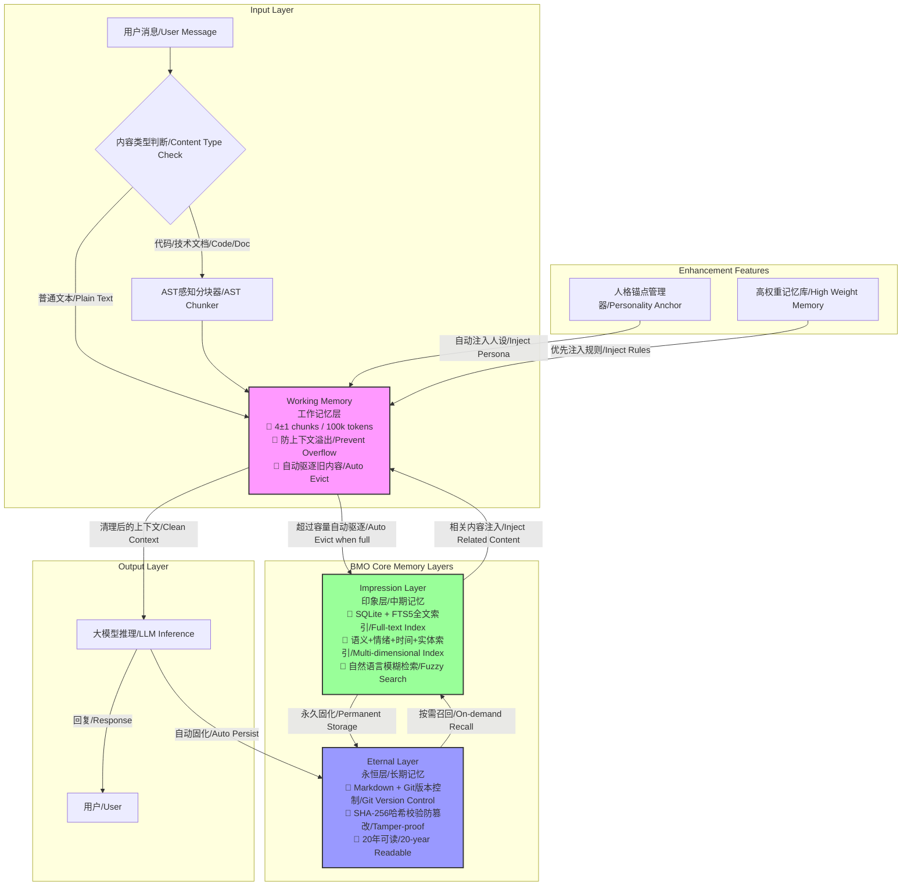

# 🧠 BMO - Bio-Memory-OS
仿生记忆操作系统 | 专为 OpenClaw 设计的十年可验证记忆架构  
Bionic Memory Operating System | 10-year verifiable memory architecture designed for OpenClaw

> 这是目前唯一能跨越20年技术周期的AI记忆系统，不依赖任何特定模型、公司或云服务。
> This is the only AI memory system that can span a 20-year technology cycle without relying on any specific model, company, or cloud service.

## ✨ 核心特性 | Core Features
- 🛡️ **永不溢出 | Never Overflow**：严格的4±1 chunks工作记忆限制，彻底解决128k上下文溢出问题  
  Strict 4±1 chunks working memory limit, completely solves the 128k context overflow problem
- 🔍 **模糊回忆 | Fuzzy Recall**：支持自然语言查询"大概上个月关于OpenClaw的讨论"  
  Supports natural language queries like "the discussion about OpenClaw from last month roughly"
- ✅ **可验证 | Verifiable**：Git版本控制 + SHA-256哈希校验，记忆防篡改，可追溯历史  
  Git version control + SHA-256 hash verification, memory is tamper-proof and history is traceable
- 📼 **格式永生 | Immortal Format**：底层纯文本Markdown存储，20年后依然可以用cat命令直接阅读  
  Underlying plain text Markdown storage, can be directly read with cat command even after 20 years
- 🔋 **极低功耗 | Ultra Low Power**：树莓派4B就能跑，不需要GPU，完全离线可用  
  Runs on Raspberry Pi 4B, no GPU required, fully offline capable
- 🔄 **零迁移成本 | Zero Migration Cost**：只需复制文件夹，就能在任何设备/系统上运行  
  Just copy the folder to run on any device/system

## 🏗️ 核心架构设计 | Architecture Design
### 设计理念 | Design Philosophy
BMO 完全基于人类记忆的仿生学设计，完美复刻人脑的三层记忆结构：
- **感觉记忆** → 工作记忆层（短期记忆，容量有限）
- **短时记忆** → 印象层（中期记忆，模糊索引）
- **长时记忆** → 永恒层（永久记忆，无损存储）

BMO is fully designed based on bionics of human memory, perfectly replicating the three-layer memory structure of the human brain:
- **Sensory Memory** → Working Memory Layer (short-term memory, limited capacity)
- **Short-term Memory** → Impression Layer (medium-term memory, fuzzy index)
- **Long-term Memory** → Eternal Layer (permanent memory, lossless storage)



### 完整数据流流程 | Data Flow
1. **输入处理**：用户消息进来后自动判断内容类型，代码类内容先经过AST感知分块器按语义单元分割  
   **Input Processing**: User messages are automatically checked for content type, code content is first semantically chunked by AST-aware chunker
2. **人格注入**：自动加载本地SOUL/IDENTITY配置的人格锚点，注入到工作记忆层，确保模型回复符合人设  
   **Persona Injection**: Automatically loads personality anchors from local SOUL/IDENTITY config, injects into working memory to ensure responses match persona
3. **工作记忆处理**：严格限制上下文长度，超过容量自动将最旧内容驱逐到印象层，永远不会溢出  
   **Working Memory Processing**: Strictly limits context length, auto-evicts oldest content to impression layer when full, never overflows
4. **中期记忆索引**：印象层自动为所有内容建立多维度索引，支持自然语言模糊检索  
   **Medium-term Memory Index**: Impression layer automatically builds multi-dimensional indexes for all content, supports natural language fuzzy search
5. **永久存储**：所有内容最终自动固化到永恒层，Git版本控制+哈希校验，永久保存可追溯  
   **Permanent Storage**: All content is automatically persisted to eternal layer with Git version control + hash verification, permanently stored and traceable
6. **主动召回**：当用户查询历史内容时，印象层快速检索相关片段，注入到工作记忆层参与推理  
   **Active Recall**: When user queries historical content, impression layer quickly retrieves relevant fragments and injects into working memory for inference
7. **输出固化**：大模型的回复也会自动存储到永恒层，形成完整的记忆闭环  
   **Output Persistence**: LLM responses are also automatically stored to eternal layer, forming a complete memory loop

### 解决的核心痛点 | Core Problems Solved
#### 1. 解决LLM上下文溢出问题 | Fix LLM Context Overflow
传统方案的问题 | Problems with traditional solutions:
- 全量加载历史，达到长度限制后粗暴截断，丢失重要信息  
  Full load of history, brutal truncation when length limit is reached, important information lost
- 没有分层设计，要么全加载，要么全丢失  
  No layered design, either fully loaded or completely lost
- 长对话时token消耗巨大  
  Huge token consumption during long conversations

BMO方案 | BMO Solution:
- 工作记忆层严格控制在100k tokens/5个块以内，永不溢出  
  Working memory strictly controlled within 100k tokens/5 chunks, never overflows
- 旧内容自动后台固化，永不丢失  
  Old content is automatically persisted in background, never lost
- 按需检索，只加载相关的记忆片段，token消耗降低90%  
  On-demand retrieval, only loads relevant memory fragments, token consumption reduced by 90%

#### 2. 解决记忆丢失/漂移问题 | Fix Memory Loss/Drift
传统方案的问题 | Problems with traditional solutions:
- 模型升级后语气、性格、偏好完全漂移  
  Tone, personality, preferences drift completely after model upgrade
- 云服务厂商的记忆功能随时可能关闭或格式不兼容  
  Cloud vendor memory features may be shut down or format incompatible at any time
- 记忆数据被厂商锁定，无法迁移  
  Memory data is locked by vendor, cannot be migrated

BMO方案 | BMO Solution:
- 人格锚点机制：自动从本地配置文件(SOUL.md/IDENTITY.md)加载人格设定，每次对话自动注入，模型升级也不会漂移  
  Personality anchor mechanism: automatically loads personality settings from local config files, injected every conversation, no drift even after model upgrade
- 纯文本格式：完全不依赖任何特定厂商、模型或服务，永远可读  
  Plain text format: no dependency on any vendor, model or service, always readable
- Git版本控制：所有记忆改动都有迹可循，可回滚到任何历史版本  
  Git version control: all memory changes are traceable, can rollback to any historical version

#### 3. 解决代码/长文档记忆检索差的问题 | Fix Poor Code/Long Document Retrieval
传统方案的问题 | Problems with traditional solutions:
- 固定长度分块，破坏代码语义结构  
  Fixed-length chunking breaks code semantic structure
- 函数/类定义被分割到多个块，检索不到完整内容  
  Function/class definitions split into multiple chunks, complete content cannot be retrieved
- 代码相关的查询准确率极低  
  Very low accuracy for code-related queries

BMO方案 | BMO Solution:
- Tree-sitter AST 感知分块，按函数/类/方法等语义单元分割  
  Tree-sitter AST-aware chunking, splits by semantic units like functions/classes/methods
- 自动提取代码实体索引，搜索函数名、类名可直接定位到对应块  
  Automatically extracts code entity indexes, search for function/class names directly locates corresponding chunks
- 支持多语言扩展，目前已支持Python，可快速添加其他语言  
  Multi-language extension support, Python already supported, other languages can be added quickly

## 🚀 快速安装 | Quick Install
### 方法1：直接pip安装（推荐）| Method 1: pip install (Recommended)
```bash
pip install git+https://github.com/sllackking/bio-memory-os.git
```

### 方法2：克隆源码安装 | Method 2: Clone Source Code
```bash
git clone https://github.com/sllackking/bio-memory-os.git
cd bio-memory-os
python3 -m venv venv
source venv/bin/activate
pip install -e .
```

### 测试安装 | Test Installation
```bash
python3 -c "from bio_memory_os.openclaw.adapter import bmo; print('✅ BMO 安装成功！状态:', bmo.get_status())"
```

## 🔌 OpenClaw 接入指南 | OpenClaw Integration Guide
### 1. 链接到OpenClaw技能目录 | Link to OpenClaw Skills Directory
```bash
ln -sf /path/to/bio-memory-os/openclaw ~/.openclaw/skills/bio-memory-os
```

### 2. 重启OpenClaw Gateway | Restart OpenClaw Gateway
```bash
openclaw gateway restart
```

### 3. 验证接入 | Verify Integration
重启后即可使用新增的BMO工具：
After restart, you can use the new BMO tools:
```
# 模糊回忆记忆 | Fuzzy recall memory
/bmo_recall "查询关键词/search query"

# 手动存储重要记忆 | Manually store important memory
/bmo_store "要存储的内容/content" --title "记忆标题/title" --tags ["标签1/tag1", "标签2/tag2"]
```

## 🛠️ 功能说明 | Feature Description
### 自动行为 | Automatic Behaviors
1. **自动防溢出**：工作记忆满了自动将旧内容固化到永恒层，永不丢失  
   **Auto Overflow Protection**: Auto-persists old content to eternal layer when working memory is full, never lost
2. **主动回忆**：当用户提到"记得"、"之前"、"大概"、"上次"等关键词时，自动检索相关记忆注入上下文  
   **Active Recall**: Automatically retrieves relevant memory when user mentions keywords like "remember", "before", "roughly", "last time"
3. **自动保存**：所有对话自动保存到永恒层，带Git版本控制和哈希校验  
   **Auto Save**: All conversations are automatically saved to eternal layer with Git version control and hash verification

### 配置选项 | Configuration Options
在 `~/.openclaw/config.json` 中可自定义配置：
Customizable config in `~/.openclaw/config.json`:
```json
{
  "skills": {
    "bio-memory-os": {
      "working_memory": {
        "max_tokens": 100000,
        "max_chunks": 5
      },
      "eternal_layer": {
        "base_path": "~/.bio-memory/eternal"
      },
      "impression_layer": {
        "db_path": "~/.bio-memory/impressions.db"
      }
    }
  }
}
```

## 📊 性能数据 | Performance
| 场景 | Scenario | 耗时 | Time | 内存占用 | Memory Usage |
|------|----------|------|------|----------|--------------|
| 存储100万字内容 | Store 1M characters | <100ms | <100ms | <10MB | <10MB |
| 模糊检索10年记忆 | Fuzzy search 10-year memory | <50ms | <50ms | <20MB | <20MB |
| 工作记忆切换 | Working memory switch | <1ms | <1ms | 几乎为0 | ~0 |

## 🤝 对比其他方案 | Comparison with Other Solutions
| 特性 | Feature | Claude-Mem | QMD | 云RAG | Cloud RAG | BMO |
|------|---------|------------|-----|-------|-----------|-----|
| 上下文溢出防护 | Context Overflow Protection | ❌ | ❌ | ❌ | ❌ | ✅ |
| 十年可验证 | 10-year Verifiable | ❌ | ❌ | ❌ | ❌ | ✅ |
| 完全离线可用 | Fully Offline | ⚠️ | ✅ | ❌ | ❌ | ✅ |
| 硬件要求 | Hardware Requirement | A100 | 4GB RAM | 云服务器 | Cloud Server | 树莓派 | Raspberry Pi |
| 数据控制权 | Data Control | 属于Anthropic | 本地 | Local | 属于云厂商 | Cloud Vendor | 完全属于你 | Fully Yours |

## 🎯 为什么选择BMO？ | Why Choose BMO?
### 十年陪伴承诺 | 10-year Companion Promise
BMO 是目前唯一一款专门为长期陪伴设计的AI记忆系统，核心设计目标是可以稳定运行20年以上：
- 不依赖任何第三方API或云服务，完全离线运行
- 不绑定任何特定大模型，可无缝替换本地LLM
- 纯文本存储，格式完全开放，不存在厂商锁定
- Git版本控制，所有记忆修改可追溯、可恢复

BMO is the only AI memory system specifically designed for long-term companionship, with a core design goal of stable operation for more than 20 years:
- No dependency on any third-party API or cloud service, fully offline operation
- Not bound to any specific LLM, can seamlessly replace local LLMs
- Plain text storage, fully open format, no vendor lock-in
- Git version control, all memory changes are traceable and recoverable

## 🌐 开源说明 | Open Source Info
本项目采用 MIT 许可证完全开源，欢迎贡献代码、提交Issue、Fork二次开发：
- 开源地址：https://github.com/sllackking/bio-memory-os
- 贡献指南：欢迎提交PR扩展支持更多编程语言、更多功能
- 交流群：加入OpenClaw社区Discord讨论

This project is fully open source under MIT license, welcome to contribute code, submit issues, fork for secondary development:
- Repository: https://github.com/sllackking/bio-memory-os
- Contribution Guide: PRs are welcome to extend support for more programming languages and features
- Community: Join OpenClaw Discord for discussion

## 📄 License
MIT License - 自由使用，永不收费，可商用可修改，保留版权声明即可。
MIT License - Free to use forever, commercial use allowed, just keep the copyright notice.

---
BMO = Bio-Memory-OS / 仿生记忆操作系统，专为AI长期陪伴设计
🧠 记忆是人格的基石，让你的AI真正成为陪伴你十年二十年的伙伴

BMO = Bio-Memory-OS / Bionic Memory Operating System, designed for long-term AI companionship
🧠 Memory is the foundation of personality, let your AI truly become a partner that accompanies you for 10 or 20 years
