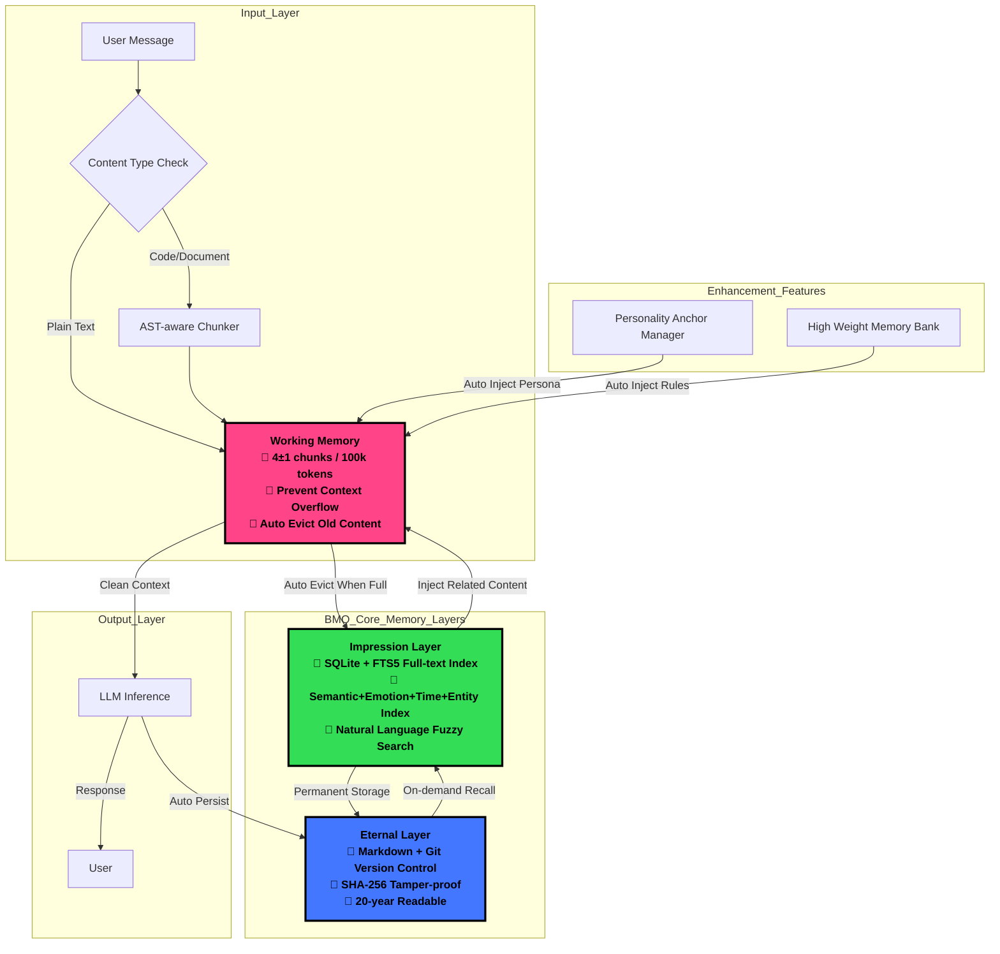

# 🧠 BMO - Bio-Memory-OS
Bionic Memory Operating System | 10-year verifiable memory architecture designed for OpenClaw

> The only AI memory system that can span a 20-year technology cycle without relying on any specific model, company, or cloud service.

[中文文档](https://github.com/sllackking/bio-memory-os/blob/main/README_zh.md) | [Documentation](https://github.com/sllackking/bio-memory-os#-quick-install)

## ✨ Core Features
- 🛡️ **Never Overflow**: Strict 4±1 chunks working memory limit, completely solves the 128k context overflow problem
- 🔍 **Fuzzy Recall**: Supports natural language queries like "discussion about OpenClaw from last month roughly"
- ✅ **Verifiable**: Git version control + SHA-256 hash verification, memory is tamper-proof and history is traceable
- 📼 **Immortal Format**: Underlying plain text Markdown storage, can be directly read with cat command even after 20 years
- 🔋 **Ultra Low Power**: Runs on Raspberry Pi 4B, no GPU required, fully offline capable
- 🔄 **Zero Migration Cost**: Just copy the folder to run on any device/system

## 🏗️ Architecture Design
### Design Philosophy
BMO is fully designed based on bionics of human memory, perfectly replicating the three-layer memory structure of the human brain:
- **Sensory Memory** → Working Memory Layer (short-term memory, limited capacity)
- **Short-term Memory** → Impression Layer (medium-term memory, fuzzy index)
- **Long-term Memory** → Eternal Layer (permanent memory, lossless storage)



### Full Data Flow
1. **Input Processing**: User messages are automatically checked for content type, code content is first semantically chunked by AST-aware chunker
2. **Persona Injection**: Automatically loads personality anchors from local SOUL/IDENTITY config, injected into working memory to ensure responses match persona
3. **Working Memory Processing**: Strictly limits context length, auto-evicts oldest content to impression layer when full, never overflows
4. **Medium-term Memory Index**: Impression layer automatically builds multi-dimensional indexes for all content, supports natural language fuzzy search
5. **Permanent Storage**: All content is automatically persisted to eternal layer with Git version control + hash verification, permanently stored and traceable
6. **Active Recall**: When user queries historical content, impression layer quickly retrieves relevant fragments and injects into working memory for inference
7. **Output Persistence**: LLM responses are also automatically stored to eternal layer, forming a complete memory loop

## 🚀 Quick Install
### Method 1: pip install (Recommended)
```bash
pip install git+https://github.com/sllackking/bio-memory-os.git
```

### Method 2: Clone Source Code
```bash
git clone https://github.com/sllackking/bio-memory-os.git
cd bio-memory-os
python3 -m venv venv
source venv/bin/activate
pip install -e .
```

### Test Installation
```bash
python3 -c "from bio_memory_os.openclaw.adapter import bmo; print('✅ BMO installed successfully! Status:', bmo.get_status())"
```

## 🔌 OpenClaw Integration Guide
### 1. Link to OpenClaw Skills Directory
```bash
ln -sf /path/to/bio-memory-os/openclaw ~/.openclaw/skills/bio-memory-os
```

### 2. Restart OpenClaw Gateway
```bash
openclaw gateway restart
```

### 3. Verify Integration
After restart, you can use the new BMO tools:
```
# Fuzzy recall memory
/bmo_recall "search query"

# Manually store important memory
/bmo_store "content" --title "memory title" --tags ["tag1", "tag2"]
```

## 📊 Performance
| Scenario | Time | Memory Usage |
|----------|------|--------------|
| Store 1M characters | <100ms | <10MB |
| Fuzzy search 10-year memory | <50ms | <20MB |
| Working memory switch | <1ms | ~0 |

## 🤝 Comparison with Other Solutions
| Feature | Claude-Mem | QMD | Cloud RAG | BMO |
|---------|------------|-----|-----------|-----|
| Context Overflow Protection | ❌ | ❌ | ❌ | ✅ |
| 10-year Verifiable | ❌ | ❌ | ❌ | ✅ |
| Fully Offline | ⚠️ | ✅ | ❌ | ✅ |
| Hardware Requirement | A100 | 4GB RAM | Cloud Server | Raspberry Pi |
| Data Control | Anthropic | Local | Cloud Vendor | Fully Yours |

## 🌐 Open Source Info
This project is fully open source under MIT license, welcome to contribute code, submit issues, fork for secondary development:
- Repository: https://github.com/sllackking/bio-memory-os
- Contribution Guide: PRs are welcome to extend support for more programming languages and features
- [中文文档](https://github.com/sllackking/bio-memory-os/blob/main/README_zh.md)

## 📄 License
MIT License - Free to use forever, commercial use allowed, just keep the copyright notice.

---
BMO = Bio-Memory-OS / Bionic Memory Operating System, designed for long-term AI companionship
🧠 Memory is the foundation of personality, let your AI truly become a partner that accompanies you for 10 or 20 years