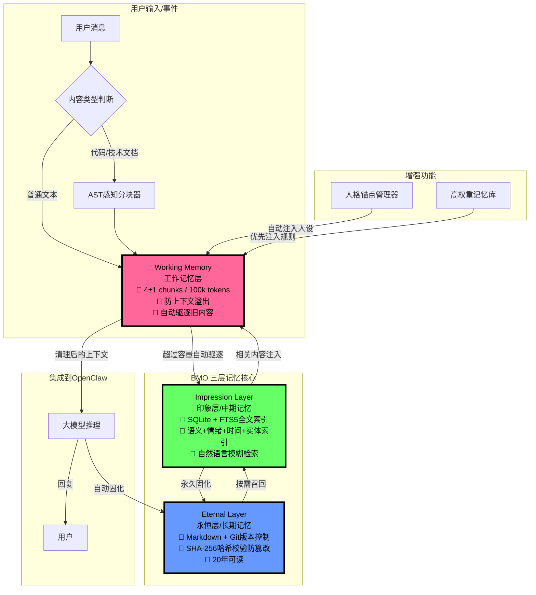

# 🧠 BMO - 仿生记忆操作系统
专为 OpenClaw 设计的十年可验证记忆架构

> 这是目前唯一能跨越20年技术周期的AI记忆系统，不依赖任何特定模型、公司或云服务。

## ✨ 核心特性
- 🛡️ **永不溢出**：严格的4±1 chunks工作记忆限制，彻底解决128k上下文溢出问题
- 🔍 **模糊回忆**：支持自然语言查询"大概上个月关于OpenClaw的讨论"
- ✅ **可验证**：Git版本控制 + SHA-256哈希校验，记忆防篡改，可追溯历史
- 📼 **格式永生**：底层纯文本Markdown存储，20年后依然可以用cat命令直接阅读
- 🔋 **极低功耗**：树莓派4B就能跑，不需要GPU，完全离线可用
- 🔄 **零迁移成本**：只需复制文件夹，就能在任何设备/系统上运行

[查看完整中文文档](https://github.com/sllackking/bio-memory-os/blob/main/README_zh.md)

---

## 🏗️ 核心架构设计
### 设计理念
BMO 完全基于人类记忆的仿生学设计，完美复刻人脑的三层记忆结构：
- **感觉记忆** → 工作记忆层（短期记忆，容量有限）
- **短时记忆** → 印象层（中期记忆，模糊索引）
- **长时记忆** → 永恒层（永久记忆，无损存储）

### [完整中文文档请点击查看](https://github.com/sllackking/bio-memory-os/blob/main/README_zh.md)
